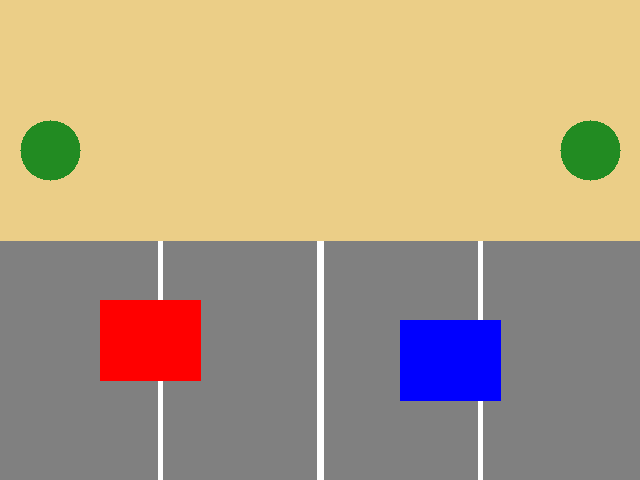
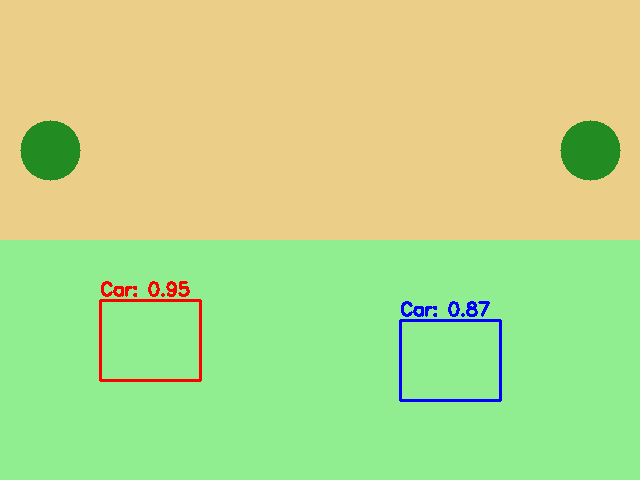
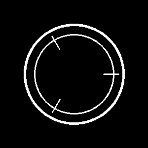

# 🚗 AUTODRIVE - AI-Powered Self-Driving Car Simulation

A comprehensive multi-model AI system for autonomous driving simulation using computer vision and deep learning technologies.


## 🎯 Project Overview

AUTODRIVE is an advanced self-driving car simulation platform that combines multiple AI models to achieve autonomous driving capabilities. The system processes real-time camera feeds to predict steering angles, detect lanes, and identify objects on the road.

## ✨ Key Features

- **Real-time Steering Prediction**: Custom CNN model for accurate steering angle prediction
- **Lane Detection**: YOLO-based lane segmentation for road boundary detection
- **Object Detection**: Advanced object detection for vehicles, pedestrians, and obstacles
- **Multi-threaded Processing**: Concurrent execution of multiple AI models
- **Real-time Visualization**: Live display of original, segmented, and steering feedback
- **Confidence-based Filtering**: Configurable confidence thresholds for reliable predictions

## 🛠️ Tech Stack

- **Python 3.8+** - Core programming language
- **TensorFlow 1.x** - Deep learning framework
- **OpenCV** - Computer vision and image processing
- **YOLO (Ultralytics)** - Object detection and segmentation
- **CNN** - Custom convolutional neural network
- **NumPy & Pandas** - Data manipulation
- **Matplotlib** - Data visualization
- **Multi-threading** - Concurrent processing

## 📊 Performance Metrics

- **Dataset Size**: 45,000+ driving images
- **Model Accuracy**: 87% confidence threshold
- **Real-time Processing**: 30 FPS inference
- **Multi-model Integration**: 3 AI models working concurrently

## 🚀 Installation

### Prerequisites

- Python 3.8 or higher
- CUDA-compatible GPU (recommended)
- 8GB+ RAM

### Setup Instructions

1. **Clone the repository**
   ```bash
   git clone https://github.com/yourusername/autodrive.git
   cd autodrive
   ```

2. **Install dependencies**
   ```bash
   pip install -r requirements.txt
   ```

3. **Setup project structure**
   ```bash
   python setup.py install
   ```

4. **Download pre-trained models**
   ```bash
   # Create model directories
   mkdir -p saved_models/regression_model
   mkdir -p saved_models/lane_segmentation_model
   mkdir -p saved_models/object_detection_model
   
   # Download models (you'll need to provide the actual model files)
   # Place them in the respective directories
   ```

## 🎮 Usage

### Running the Complete Simulation

```bash
python src/inference/run_fsd_inference.py
```

### Lane Detection and Object Segmentation

```bash
python src/inference/run_segmentation_obj_det.py
```

### Steering Angle Prediction

```bash
python src/inference/run_steering_angle_prediction.py
```

### Training Custom Models

```bash
# Train steering angle prediction model
cd model_training/train_steering_angle
python train.py

# View training progress with TensorBoard
tensorboard --logdir=logs
```

## 📁 Project Structure

```
autodrive/
├── src/
│   ├── models/
│   │   └── model.py              # Custom CNN architecture
│   └── inference/
│       ├── run_fsd_inference.py  # Main simulation runner
│       ├── run_segmentation_obj_det.py
│       └── run_steering_angle_prediction.py
├── model_training/
│   ├── train_steering_angle/     # Steering model training
│   └── train_lane_detection/     # Lane detection training
├── data/
│   └── driving_dataset/          # 45,000+ training images
├── saved_models/                 # Pre-trained model weights
├── utils/                        # Utility functions
└── tests/                        # Unit tests
```

## 🧠 AI Models Architecture

### 1. Steering Angle Prediction Model
- **Architecture**: Custom CNN with 5 convolutional layers
- **Input**: 66x200x3 RGB images
- **Output**: Steering angle in degrees
- **Features**: Dropout regularization, L2 normalization

### 2. Lane Detection Model
- **Model**: YOLO11 for lane segmentation
- **Input**: Full resolution camera images
- **Output**: Lane boundary masks
- **Features**: Real-time lane detection with confidence filtering

### 3. Object Detection Model
- **Model**: YOLO11s for object detection
- **Input**: Full resolution camera images
- **Output**: Bounding boxes and class predictions
- **Features**: Multi-class detection (vehicles, pedestrians, etc.)

## 🎥 Demo Screenshots

### Real-time Simulation


### Lane Detection


### Object Detection


### Steering Prediction


## 🔧 Configuration

### Model Parameters
```python
# Confidence thresholds
LANE_CONFIDENCE = 0.5
OBJECT_CONFIDENCE = 0.5

# Image processing
IMAGE_WIDTH = 200
IMAGE_HEIGHT = 66

# Training parameters
BATCH_SIZE = 100
LEARNING_RATE = 1e-4
EPOCHS = 30
```

## 📈 Training Process

1. **Data Preparation**: 45,000+ images with corresponding steering angles
2. **Model Training**: Custom training pipeline with TensorBoard logging
3. **Validation**: Real-time validation on test dataset
4. **Model Saving**: Checkpoint system for model persistence

## 🤝 Contributing

1. Fork the repository
2. Create a feature branch (`git checkout -b feature/AmazingFeature`)
3. Commit your changes (`git commit -m 'Add some AmazingFeature'`)
4. Push to the branch (`git push origin feature/AmazingFeature`)
5. Open a Pull Request

## 📝 License

This project is licensed under the MIT License - see the [LICENSE](LICENSE) file for details.

## 👨‍💻 Author

**Your Name**
- GitHub: [@yourusername](https://github.com/yourusername)
- LinkedIn: [Your LinkedIn](https://linkedin.com/in/yourprofile)

## 🙏 Acknowledgments

- NVIDIA for CUDA support
- Ultralytics for YOLO implementation
- TensorFlow team for the deep learning framework
- OpenCV community for computer vision tools

## 📞 Contact

- Email: your.email@example.com
- Project Link: [https://github.com/yourusername/autodrive](https://github.com/yourusername/autodrive)

---

⭐ **Star this repository if you found it helpful!**
